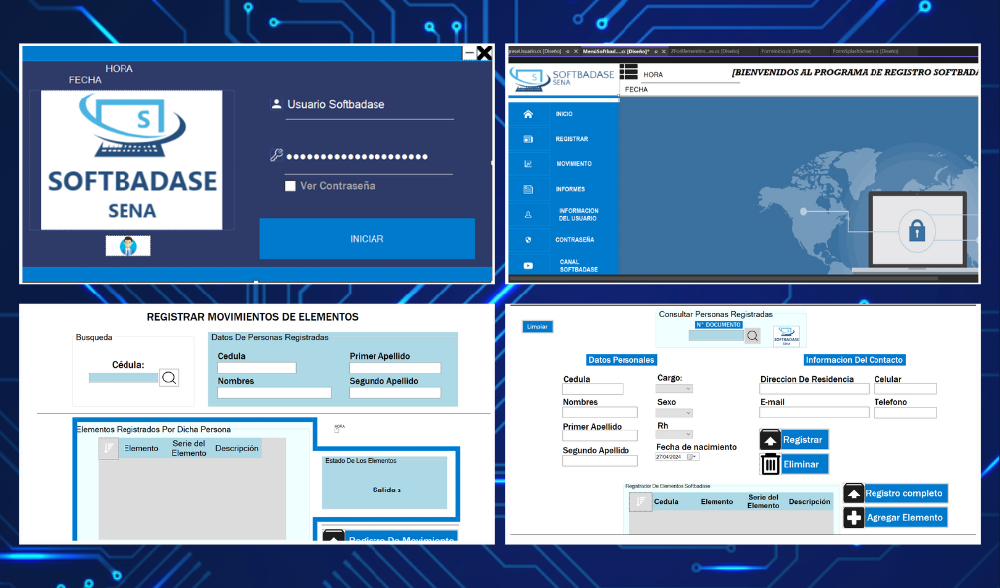

<h1>SoftBadase</h1>

<h3>Software de escritorio para registro del personal</h3>

Durante mi formación en el SENA en 2019, tuve el privilegio de desarrollar e implementar un software de escritorio diseñado para el control eficiente de registros de equipos y personal que ingresaban o salían del complejo. Este sistema, meticulosamente desarrollado, se convirtió en una herramienta fundamental para mejorar la seguridad dentro de las instalaciones.

El software se distingue por su funcionalidad sólida y su interfaz intuitiva, permitiendo un seguimiento detallado y preciso de los registros de entrada y salida. Gracias a su implementación, se logró una mayor seguridad en el complejo, brindando tranquilidad tanto a los administradores como al personal.

Su impacto positivo no solo se refleja en la seguridad, sino también en la eficiencia operativa. Al automatizar el proceso de registro, se redujeron los tiempos de espera y se optimizó la gestión del personal de seguridad.

En resumen, este software representa una contribución significativa a la mejora continua de los procesos de seguridad y control dentro del entorno del SENA, demostrando mi capacidad para diseñar soluciones tecnológicas efectivas y funcionales.

